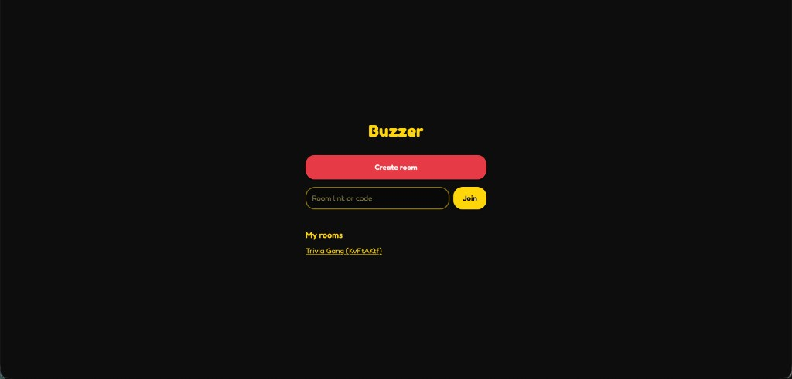
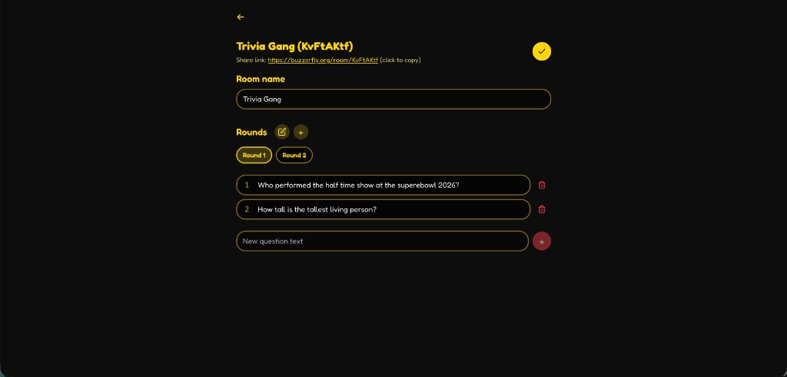
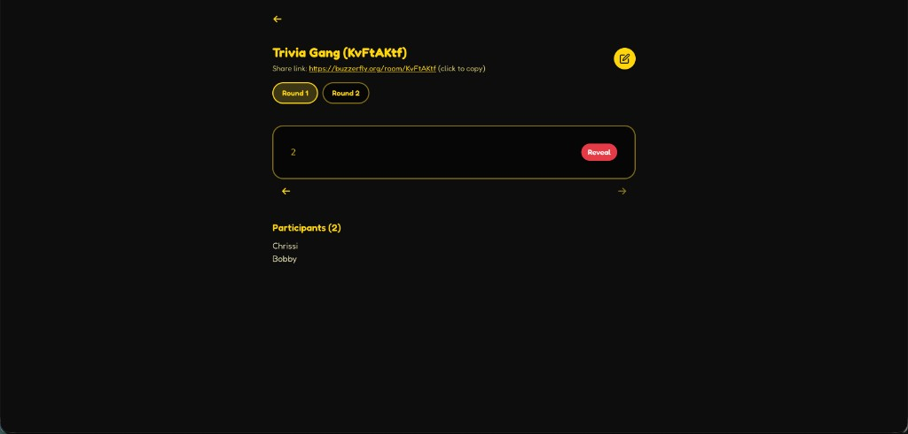
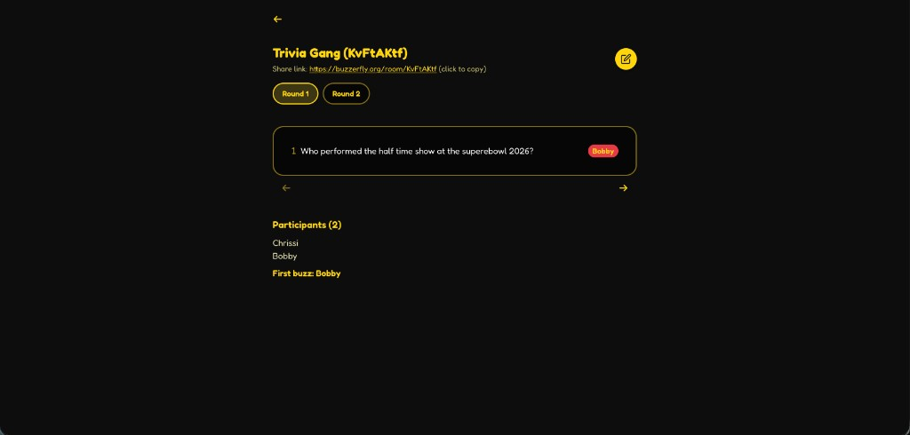
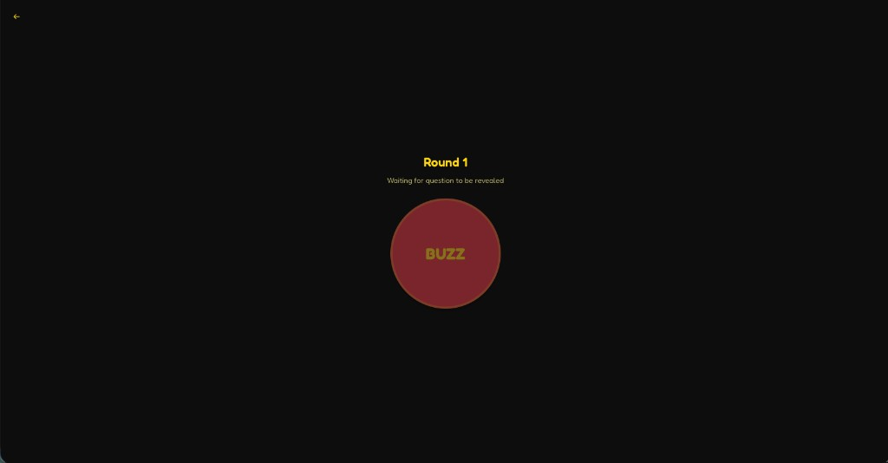
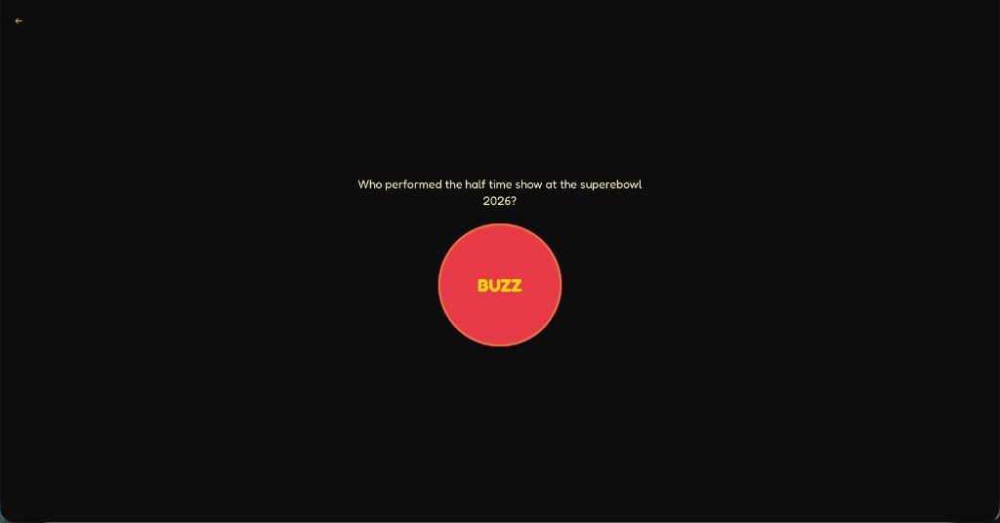

# Buzzer

A web app for room-based quiz rounds: an admin creates rooms with named rounds and question cards, shares a link, and participants join to see the round name until the admin reveals a question—then the buzzer activates.

## Screenshots

Images are sized for comfortable viewing on typical laptop widths (about 560px wide); they remain readable in the GitHub viewer and on smaller screens.

### Home

<p align="center">
  
</p>

### Host — edit room

<p align="center">
  
</p>

### Host — before reveal

<p align="center">
  
</p>

### Host — live room (question revealed, buzzer state)

<p align="center">
  
</p>

### Player — waiting for question

<p align="center">
  
</p>

### Player — question visible

<p align="center">
  
</p>

## Stack

- **Frontend**: React (Vite) + TypeScript + Tailwind CSS + React Router
- **Backend**: Node.js + Express + Socket.io
- **Database**: PostgreSQL with Prisma

This repo is an **npm workspace** with `client` and `server` packages. Run `npm install` once from the repository root to install both.

## Setup

### 1. PostgreSQL

Create a database, then copy `server/.env.example` to `server/.env` and adjust values. For **Neon**, use a pooled `DATABASE_URL` and a direct `DIRECT_URL` as in the example file.

```
DATABASE_URL="postgresql://…"
DIRECT_URL="postgresql://…"
PORT=3001
CLIENT_ORIGIN=http://localhost:5173
```

`CLIENT_ORIGIN` must match the URL users open in the browser (used for CORS and Socket.io). The server also accepts the corresponding `www` / non-`www` variant when they differ.

### 2. Install and migrate

From the project root:

```bash
npm install
cd server && npm run db:migrate -- --name init
```

For later schema changes, run `cd server && npm run db:migrate` and follow the Prisma prompts (or use `npm run db:push` for prototyping without migrations). `npm run db:generate` in `server` regenerates the Prisma client after schema changes.

### 3. Run (development)

**Terminal 1 — API and WebSockets**

```bash
cd server && npm run dev
```

**Terminal 2 — Vite dev server**

```bash
cd client && npm run dev
```

The Vite config proxies `/api` and `/socket.io` to `http://localhost:3001`, so you usually do **not** need a client `.env` for local dev.

Open [http://localhost:5173](http://localhost:5173). Create a room, add rounds and questions, share the room link, and join as a participant to use the buzzer.

## Production / single host

1. Set `server/.env` (or your host’s env) with a production `DATABASE_URL`, `PORT`, and `CLIENT_ORIGIN` pointing at your public site URL.
2. Build the client: `cd client && npm run build`.
3. Start the server: `cd server && npm start`.

If `client/dist` exists next to `server`, the server serves the built React app and handles routing for the SPA.

If the static files are hosted separately from the API, build the client with `VITE_BACKEND_URL` set to your API origin (no trailing slash), e.g. `VITE_BACKEND_URL=https://api.example.com npm run build`, so REST calls and Socket.io use that host.

## Useful commands

| Location | Command | Purpose |
|----------|---------|---------|
| `client` | `npm run dev` | Vite dev server |
| `client` | `npm run build` | Typecheck + production bundle |
| `client` | `npm run preview` | Preview production build locally |
| `server` | `npm run dev` | API + sockets with `--watch` |
| `server` | `npm start` | Run server without watch |
| `server` | `npm run db:migrate` | Prisma migrate dev |
| `server` | `npm run db:push` | Push schema without migration files |
| `server` | `npm run db:generate` | `prisma generate` |

Health check: `GET /api/health` on the server.
